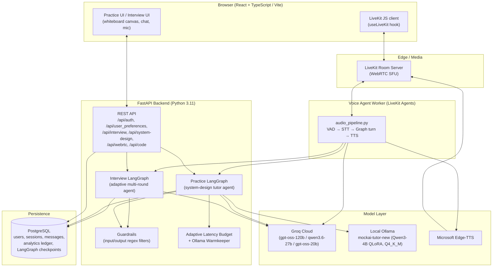

# MockAI — Production-Grade AI Interview Preparation Platform

MockAI is a full-stack, voice-driven interview preparation platform built as a portfolio
project for software engineering roles. It combines a **LangGraph-orchestrated
multi-agent backend**, a **locally fine-tuned tutor model**, a **real-time voice pipeline**,
and **whiteboard-vision system-design grading** into a single product.

This README documents the system as it exists in this codebase.
---

## Table of Contents

1. [Why This Exists](#why-this-exists)
2. [System Architecture](#system-architecture)
3. [Tech Stack](#tech-stack)
4. [Repository Structure](#repository-structure)
5. [Core Subsystems](#core-subsystems)
6. [Data Model](#data-model)
7. [API Reference](#api-reference)
8. [Local Setup](#local-setup)
9. [Environment Variables](#environment-variables)
10. [Running the Platform](#running-the-platform)
11. [Fine-Tuning the Tutor Model](#fine-tuning-the-tutor-model)
12. [Engineering Highlights](#engineering-highlights)
13. [Lessons Learned](#lessons-learned)
14. [Disclaimer](#disclaimer)

---

## Why This Exists

MockAI is built to demonstrate the kind of systems-engineering judgment expected at the
system design level: multi-agent orchestration with durable state, adaptive latency
budgeting under real hardware constraints (a single 4GB VRAM laptop GPU), LLM-as-judge
verification loops with circuit breakers and graceful degradation, and a fine-tuned local
model shipped end-to-end from synthetic data generation to a quantized GGUF served via
Ollama. It is developed on **Windows 11 + WSL2 (Ubuntu 22.04)** with an **RTX 3050 Laptop
GPU (4GB VRAM)**, so every latency and memory decision in this codebase is a deliberate
trade-off against that budget rather than an assumption of cloud-scale hardware.


## System Architecture



## Tech Stack

| Layer | Technology |
|---|---|
| Backend framework | FastAPI (Python 3.11), Uvicorn |
| Agent orchestration | LangGraph (`StateGraph`, Postgres-backed checkpointer, `interrupt_after` HITL pauses) |
| Database / ORM | PostgreSQL, SQLAlchemy 2.0 (async), `asyncpg` |
| Auth | JWT (access + refresh tokens) |
| Cloud LLM inference | Groq (`openai/gpt-oss-120b`, `qwen/qwen3.6-27b`, `openai/gpt-oss-20b`) |
| Local LLM inference | Ollama, serving a QLoRA-fine-tuned **Qwen3-4B-Instruct-2507** (GGUF, Q4_K_M) |
| Fine-tuning | Unsloth (`FastLanguageModel`), TRL `SFTTrainer`, PEFT/LoRA |
| Model export | `llama.cpp` (`convert_hf_to_gguf.py`, `llama-imatrix`, `llama-quantize`) |
| Voice / real-time media | LiveKit (WebRTC SFU + Agents framework), Silero VAD, Groq Whisper (`whisper-large-v3-turbo`) STT, `edge-tts` |
| Vision | Groq vision model for whiteboard diagram transcription |
| Frontend | React + TypeScript (Vite), one JSX page |
| Dev hardware | Windows 11 + WSL2 (Ubuntu 22.04), RTX 3050 Laptop GPU (4GB VRAM) |
| Training hardware | Kaggle T4 (cloud) |

## Repository Structure

```
backend/
├── main.py                       # FastAPI app, lifespan (DB + checkpointer + graphs + warmkeeper)
├── Dockerfile
├── agents/
│   ├── graph/
│   │   ├── state.py              # InterviewState, TutorSystemDesignState (TypedDicts)
│   │   ├── interview_graph.py    # Adaptive multi-round interview StateGraph
│   │   └── practice_graph.py     # System-design tutor StateGraph
│   ├── nodes/
│   │   ├── interview_nodes/      # scrapper, planner, oa, technical, system_design,
│   │   │                         # behavioural, evaluator, feedback_ledger, guardrail,
│   │   │                         # memory, early_termination, router
│   │   └── tutor_nodes/          # sysdesign_tutor_node, system_design_hint_node,
│   │                             # whiteboard_vision_node, design_validator_node,
│   │                             # groundedness_judge, latency_budget, guardrails,
│   │                             # local_model_client, ollama_warmkeeper, observability
│   └── tools/                    # code_executor.py (OA sandbox), company_rounds.py
├── api/routes/                   # auth.py, interview.py, practice.py
├── core/security.py              # Pydantic settings / secrets
├── db/                            # models.py, repository.py, session.py, checkpointer.py
├── middleware/                    # CORS/CSRF, error handling
├── security/jwt.py
├── webrtc/                        # audio_pipeline.py, custom_edge_tts.py, livekit_client.py
└── tests/                         # placeholders (not yet implemented)

frontend/src/
├── pages/                         # Interview.tsx, MockInterview.tsx, Practice.jsx, WorkHomePage.tsx, LandingPage.tsx
├── components/                    # Header, Hero, Features, Pricing, FAQ, Footer, + several stub components
├── hooks/useLiveKit.ts            # WebRTC room connection + data-channel telemetry
├── auth/auth.tsx
└── store/interviewStore.ts        # (stub)

scripts/                            # Fine-tuning pipeline (see finetune-pipeline-uml.md)
├── build_dataset.py               # Groq-generated synthetic ChatML dataset
├── download_base_model.py         # Pulls Qwen3-4B (4-bit + full) from HF Hub
├── train.py                       # Unsloth QLoRA SFT training
├── smoke.py                       # 1-step forward/backward smoke test before full training
├── analyse_training.py            # Eval-loss / perplexity check on merged model
├── merge.py                       # LoRA adapter → merged HF checkpoint + sanity generation
├── gguf_convert.sh                # HF checkpoint → f16 GGUF (llama.cpp)
├── build_calibration.py           # Builds imatrix calibration corpus from train.jsonl
├── quantize_gguf.sh                # imatrix + Q4_K_M quantization
└── pipeline.py                    # Narrative log / orchestration notes for the above
```

## Core Subsystems

### 1. System-Design Tutor (LangGraph)
A 4-node `StateGraph` (`practice_graph.py`) that asks a fresh staff-level system-design
question, gives structured HLD/LLD/design-pattern hints, transcribes the candidate's
whiteboard into a structured diagram schema via a vision model, and grades the diagram —
all gated by an **LLM-as-judge groundedness check** with adaptive latency budgets, circuit
breakers, and canned fallbacks so the UX degrades gracefully on a 4GB-VRAM GPU.
→ Full HLD/LLD in [`tutor-nodes-uml.md`](docs/architecture/tutor-nodes-uml.md).

### 2. Adaptive Multi-Round Interview (LangGraph)
A larger `StateGraph` (`interview_graph.py`) that scrapes/loads target-company context,
plans a round blueprint (OA → Technical/DSA → System Design → Behavioral), dispatches to
per-round agent nodes, runs every round through a guardrail check and durable memory sync,
evaluates performance, and can terminate a session early on repeated guardrail strikes.

### 3. Voice Pipeline (LiveKit)
A LiveKit Agents worker (`webrtc/audio_pipeline.py`) that pipes microphone audio through
Silero VAD → Groq Whisper STT → the appropriate LangGraph (`ainvoke`) → a custom
`edge-tts`-backed TTS implementation, while publishing `state_update`/`tutor_hint`
telemetry over a LiveKit data channel back to the frontend.
→ Full HLD/LLD in [`voice-pipeline-uml.md`](docs/architecture/voice-pipeline-uml.md).

### 4. Fine-Tuned Local Tutor Model
Qwen3-4B-Instruct-2507 is QLoRA-fine-tuned on a synthetic, Claude-generated DSA/system-design
dataset (spoken-language style, ChatML format with assistant-span label masking), merged,
converted to GGUF, imatrix-calibrated, quantized to Q4_K_M, and served locally via Ollama
as `mockai-tutor-new` — the model the tutor nodes call for hints/QA/concept/validation
generation.
→ Full HLD/LLD in [`finetune-pipeline-uml.md`](docs/architecture/finetune-pipeline-uml.md).

### 5. Guardrails, Judging & Adaptive Latency
Cross-cutting infrastructure shared by every tutor node:
- **`guardrails.py`** — cheap regex-based input/output checks (prompt-injection patterns,
  length caps, leaked internal markers) that fail closed before spending a model call.
- **`groundedness_judge.py`** — an independent Groq judge (never the same model as any
  generator) verifies every generated hint/answer/validation against the actual whiteboard
  content and question, with a circuit breaker that skips a failing primary judge for 60s,
  a backup judge model, and a tie-break comparison when no candidate is fully verified.
- **`latency_budget.py`** — an `AdaptiveLatencyBudget` per node type that learns
  warm/cold-start response-time distributions online (EWMA average + swing) and derives a
  per-call timeout, so the system self-tunes to the actual GPU instead of a hardcoded guess.
- **`ollama_warmkeeper.py`** — a background loop that pings Ollama every 4 minutes to keep
  the fine-tuned model resident in VRAM and avoid cold-start latency spikes.

## Data Model

| Table | Purpose |
|---|---|
| `users` | Account, hashed password, role, timestamps |
| `user_context_caches` | Cached parsed resume / GitHub repo context (hash-deduplicated) |
| `interview_sessions` | Per-session config (job title, tech stack, difficulty, voice model, rounds blueprint), status, overall score |
| `conversational_history` | Per-round message log (role, text, audio path, AI correction) |
| `user_analytics_ledgers` | Longitudinal strengths/weaknesses/behavioral notes/running average score per user |
| LangGraph checkpoint tables | Managed by `AsyncPostgresSaver` — durable graph state + HITL interrupt/resume |

## API Reference

| Route | Method | Purpose |
|---|---|---|
| `/api/auth/signup`, `/login`, `/refresh`, `/me` | POST/GET | Auth |
| `/api/user_preferences/...` | POST | Save interview configuration, kick off `interview_graph` |
| `/api/interview/...` | — | Interview-round interactions |
| `/api/system-design/session` | GET | Start a tutor session (`ainvoke` the practice graph) |
| `/api/system-design/session/{thread_id}/submit` | POST | Upload whiteboard image → vision + validation |
| `/api/system-design/session/{thread_id}/ask-concept` | POST | Typed concept/Q&A question mid-session |
| `/api/system-design/session/{thread_id}/stop` | POST | End tutor session |
| `/api/webrtc/token/{session_id}` | GET | Issue a scoped LiveKit access token |
| `/api/code/run`, `/api/code/{session_id}/submit` | POST | Sandbox code execution (OA round) |
| `/health` | GET | Warmkeeper + graph-readiness check |

## Local Setup

**Prerequisites**
- Windows 11 + WSL2 (Ubuntu 22.04) or native Linux
- Python 3.11
- Node.js 18+
- PostgreSQL 14+
- [Ollama](https://ollama.com) (for the fine-tuned tutor model)
- A LiveKit server (self-hosted or LiveKit Cloud) for the voice pipeline
- Groq API key (question generation, whiteboard vision, judging, interviewer rounds, STT)

```bash
# Backend
cd backend
python3.11 -m venv .venv && source .venv/bin/activate
pip install -r requirements.txt      # fastapi, sqlalchemy[asyncio], asyncpg, langgraph,
                                      # langgraph-checkpoint-postgres, groq, httpx, livekit-agents,
                                      # livekit-plugins-silero/openai/groq, edge-tts, pillow, pydantic
cp .env.example .env                 # fill in the variables below

# Frontend
cd ../frontend
npm install
```

## Environment Variables

| Variable | Used by | Purpose |
|---|---|---|
| `GROQ_API_KEY` | tutor nodes, interview nodes, STT | Groq Cloud inference |
| `GEMINI_API_KEY` | interview nodes | Secondary LLM provider |
| `DATABASE_URL` | `db/session.py`, `db/checkpointer.py` | Postgres connection (`postgresql+asyncpg://...`) |
| `JWT_SECRET_KEY` / `JWT_REFRESH_SECRET_KEY` | `security/jwt.py` | Token signing |
| `LIVEKIT_API_KEY` / `LIVEKIT_API_SECRET` / `LIVEKIT_URL` | `webrtc/livekit_client.py`, `practice.py` | Voice room auth |
| `DEEPGRAM_API_KEY` | reserved | Alternate STT provider (not currently wired in) |
| `TAVILY_API_KEY` | `scrapper_node.py` | Company research web search |
| `qdrant_api_key` / `qdrant_url` | reserved | Vector store (candidate for RAG features) |
| `FINE_TUNED_TUTOR_MODEL` | `local_model_client.py`, `ollama_warmkeeper.py` | Ollama model tag (default `mockai-tutor-new:latest`) |
| `LOCAL_LLM_HOST` / `OLLAMA_NATIVE_URL` | `local_model_client.py`, `ollama_warmkeeper.py` | Ollama base URL (default `http://localhost:11434`) |

## Running the Platform

```bash
# 1. Start Postgres and Ollama (with the fine-tuned model already `ollama create`-d)
ollama serve

# 2. Start the FastAPI backend (builds tables, opens checkpointer, warms the model)
cd backend && uvicorn backend.main:app --reload --port 8000

# 3. Start the LiveKit voice agent worker (separate process)
cd backend && python -m backend.webrtc.audio_pipeline dev

# 4. Start the frontend
cd frontend && npm run dev
```

## Fine-Tuning the Tutor Model

See [`finetune-pipeline-uml.md`](docs/architecture/finetune-pipeline-uml.md) for the full
diagram, but at a glance:

```bash
python scripts/build_dataset.py          # Groq → ChatML train/eval jsonl
python scripts/download_base_model.py --variant both
python scripts/smoke.py                  # 1-step forward/backward sanity check
python scripts/train.py                  # Unsloth QLoRA SFT on Qwen3-4B (Kaggle T4)
python scripts/merge.py                  # merge LoRA adapter + sanity generation
python scripts/analyse_training.py       # eval loss / perplexity on merged model
bash scripts/gguf_convert.sh <merged_dir> <out.gguf>
python scripts/build_calibration.py      # imatrix calibration corpus
bash scripts/quantize_gguf.sh <f16.gguf> # imatrix + Q4_K_M
ollama create mockai-tutor-new -f Modelfile
```

## Engineering Highlights

- **Judge/generator model isolation is enforced at import time** — `groundedness_judge.py`
  raises on import if the primary or backup judge model matches any generator model, so
  self-evaluation bias literally cannot ship.
- **Graceful degradation ladder** on every tutor node: verified model output → judge
  reports the specific issue and the model gets one correction attempt → if nothing passes,
  a tie-break judge picks the least-bad candidate → if generation fails outright, a
  hand-written canned fallback is served — the user never sees a hard failure.
- **Cold-start-aware timeouts**: the same node type gets a much larger timeout budget right
  after Ollama evicts the model than once it's warm, learned online per node rather than
  hardcoded, which matters a lot on a 4GB VRAM card where cold loads are expensive.
- **HITL via LangGraph interrupts**: both graphs use `interrupt_after` so a human turn
  (candidate speaking, drawing, or typing) pauses the graph at a durable Postgres
  checkpoint.


## Lessons Learned

The fine-tuning run was retrained three times before it worked: the first attempt answered
in Russian, the second never learned to emit a stop token, and the third, built by jumping
straight into code instead of following documentation or tutorials first and it worked, and cost
enough debugging along the way to surface a lot of adjacent fine-tuning concepts that
wouldn't have come up otherwise. That "break first, understand why, fix it" loop is a
deliberate part of how this project was built, not just a footnote. 
I'm committing this code unpolished and it remains unrefined by design: I'm committing it intact so I can always look back at the exact missteps that built my understanding.

## Disclaimer

This is a self-directed portfolio project, not a production SaaS. Auth, rate limiting, and
cost controls exist to demonstrate engineering competence, not to withstand adversarial
production traffic.